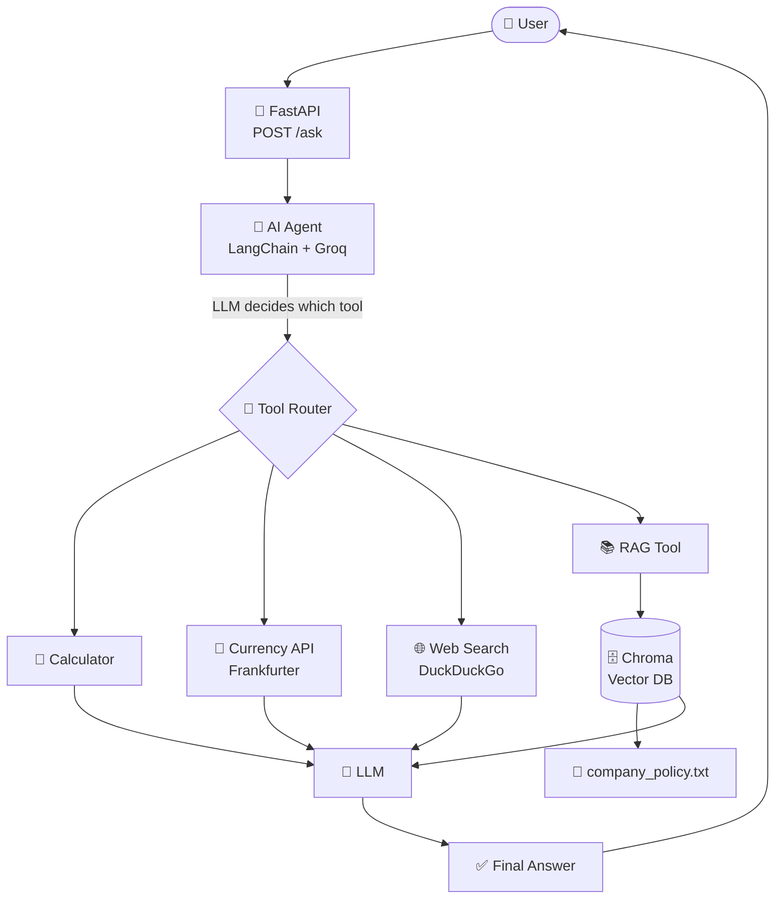

<div align="center">

# 🤖 Smart Developer Assistant Agent

### An LLM-powered agent that understands your question and picks the right tool to answer it.

<br>


<br>

[Features](#-features) •
[Architecture](#-architecture) •
[Tech Stack](#-tech-stack) •
[Getting Started](#-getting-started) •
[API Usage](#-api-usage) •
[Testing](#-testing)

</div>

---

## 📖 Overview

**Smart Developer Assistant** is an AI agent built with **LangChain** and **Groq**. Instead of answering everything from the model's memory, the agent *reasons about each question* and dynamically chooses the best tool: a calculator, a live currency API, web search, or a RAG pipeline over company documents.

It is exposed through a **FastAPI** REST endpoint with **Pydantic** validation and covered by **Pytest** tests.

---

## ✨ Features

| | Feature | Description |
|---|---|---|
| 🤖 | **LLM-Powered Agent** | Groq-hosted LLM decides which tool to call |
| 🔧 | **Dynamic Tool Selection** | Picks the right tool per query, automatically |
| 🧮 | **Calculator** | Accurate mathematical operations |
| 💱 | **Currency Conversion** | Live exchange rates via the Frankfurter API |
| 🌐 | **Web Search** | Current information via DuckDuckGo |
| 📚 | **RAG Policy Search** | Answers from company documents with citations to source text |
| 🗄️ | **Vector Database** | Chroma stores and retrieves document embeddings |
| 🚀 | **REST API** | Fast, async FastAPI backend with Swagger docs |
| 🛡️ | **Request Validation** | Pydantic models reject bad input |
| 🧪 | **Automated Tests** | Pytest suite for API endpoints |
| ⚠️ | **Error Handling** | Graceful failures instead of crashes |

---

## 🏗️ Architecture



### How it works

1. **User** sends a question to the `/ask` endpoint.
2. **FastAPI** validates the request with Pydantic.
3. The **Agent** reads the question and decides which tool fits best.
4. The selected **tool** runs and returns its result.
5. The **LLM** turns the tool output into a clear, natural-language answer.

---

## 🛠️ Tech Stack

<table>
<tr>
<td valign="top" width="50%">

**⚙️ Backend**
- 🐍 Python
- ⚡ FastAPI
- 🛡️ Pydantic

**🧠 AI & LLM**
- 🦜 LangChain (Tools & Agents)
- 🤖 Groq

**📚 RAG & Vector Store**
- 🔎 Retrieval-Augmented Generation
- 🗄️ Chroma

</td>
<td valign="top" width="50%">

**🔌 External APIs & Tools**
- 💱 Frankfurter API (currency)
- 🌐 DuckDuckGo Search (web)
- 🔗 Requests (HTTP)

**🧰 Testing & Dev**
- 🧪 Pytest
- 🌿 Git & GitHub
- 🔐 python-dotenv

</td>
</tr>
</table>

---

## 📁 Project Structure

```text
developer-agent/
│
├── app/
│   ├── agent/
│   │   └── agent.py            # Agent setup & tool orchestration
│   │
│   ├── rag/
│   │   └── vector_store.py     # Chroma vector store logic
│   │
│   ├── tools/
│   │   ├── calculator.py       # Math tool
│   │   ├── currency.py         # Currency conversion tool
│   │   ├── rag_tool.py         # Company policy search tool
│   │   └── web_search.py       # Web search tool
│   │
│   └── main.py                 # FastAPI app & routes
│
├── documents/
│   └── company_policy.txt      # Knowledge base for RAG
│
├── tests/
│   └── test_api.py             # API tests
│
├── .gitignore
├── pytest.ini
├── requirements.txt
└── README.md
```

---

## 🚀 Getting Started

### Prerequisites

- Python 3.10 or higher
- A free [Groq API key](https://console.groq.com/keys)

### 1️⃣ Clone the repository

```bash
git clone https://github.com/vnsh223/smart-developer-assistant.git
cd smart-developer-assistant
```

### 2️⃣ Create a virtual environment

```bash
python -m venv venv
```

Activate it:

| OS | Command |
|---|---|
| 🐧 Linux / 🍎 macOS | `source venv/bin/activate` |
| 🪟 Windows | `venv\Scripts\activate` |

### 3️⃣ Install dependencies

```bash
pip install -r requirements.txt
```

### 4️⃣ Configure environment variables

Create a `.env` file in the project root:

```env
GROQ_API_KEY=your_groq_api_key
```

> [!WARNING]
> Never commit your `.env` file or API key to GitHub. Make sure `.env` is listed in `.gitignore`.

### 5️⃣ Run the app

```bash
uvicorn app.main:app --reload
```

| Resource | URL |
|---|---|
| 🌐 App | http://127.0.0.1:8000 |
| 📘 Swagger Docs | http://127.0.0.1:8000/docs |

---

## 📡 API Usage

### `POST /ask`

Send a question to the AI agent. It automatically chooses the right tool.

**Request**

```json
{
  "question": "What is 25 multiplied by 20?"
}
```

**Response**

```json
{
  "answer": "25 multiplied by 20 is 500."
}
```

**Using cURL**

```bash
curl -X POST "http://127.0.0.1:8000/ask" \
  -H "Content-Type: application/json" \
  -d '{"question": "Convert 100 USD to INR."}'
```

### 💬 Example Questions

| Question | Tool Used |
|---|---|
| `What is 25 multiplied by 20?` | 🧮 Calculator |
| `Convert 100 USD to INR.` | 💱 Currency Converter |
| `What is the latest Python version?` | 🌐 Web Search |
| `How many paid leave days do employees get?` | 📚 Company Policy RAG |

---

## 🧪 Testing

Run the test suite:

```bash
pytest
```

**Test coverage includes:**

- ✅ Home endpoint
- ✅ Health check endpoint
- ✅ Empty question validation

**Example output:**

```text
================ 3 passed ================
```

---

## 🗺️ Roadmap

- [ ] Add conversation memory
- [ ] Support uploading custom documents for RAG
- [ ] Add Docker support
- [ ] Add a simple web UI
- [ ] Deploy to the cloud

---

## 🤝 Contributing

Contributions, issues, and feature requests are welcome!

1. Fork the repository
2. Create your branch: `git checkout -b feature/amazing-feature`
3. Commit your changes: `git commit -m "Add amazing feature"`
4. Push to the branch: `git push origin feature/amazing-feature`
5. Open a Pull Request

---

## 👨‍💻 Author

<div align="center">

**Vansh Kumar**

[](https://github.com/vnsh223)
[](https://www.linkedin.com/in/vansh6994/)

<br>

⭐ **If you found this project useful, please consider giving it a star!** ⭐

</div>
